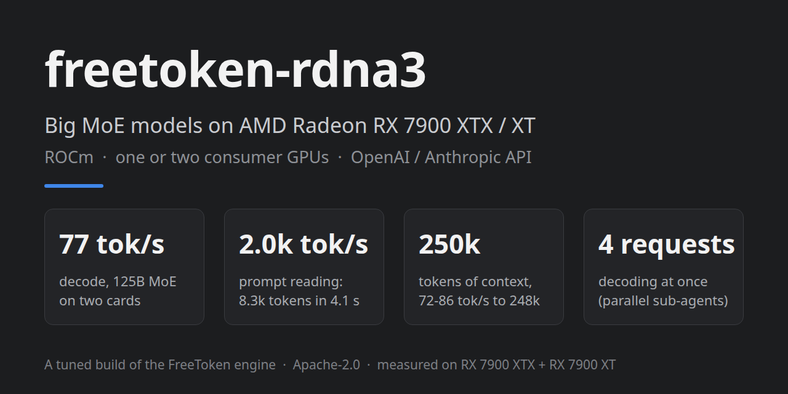

# freetoken-rdna3



**Fast local inference of big Mixture-of-Experts models on AMD Radeon RX 7900 XTX / 7900 XT (RDNA3, ROCm), on one or
two consumer GPUs** (Linux, ~96-128 GB of system RAM, ~135 GB of disk for the model). A tuned build of the [FreeToken](https://github.com/FlashML-org/FreeToken) MoE engine: tensor
parallelism across two unequal cards, a GPU expert cache fed from system RAM, int8 dense layers, exact sampling on
ROCm, up to 4 concurrent requests (parallel sub-agents), and a RAM tier that keeps conversations pushed off the GPUs
instead of recomputing them.

Built for, and measured with, **Qwen3.8-Flash-Next** only (125B-parameter MoE, ~6B active per token, NVFP4) behind
a coding agent (OpenCode), with an OpenAI- and Anthropic-compatible API. Image input is optional
(`rdna3/serve.sh --vision`). It costs no measurable speed on two cards and ~1.5-2 % of decode on one
([limits](docs/rdna3/limits.md#images-vision)).

| On an RX 7900 XTX + RX 7900 XT (`xtx-xt`) | freetoken-rdna3, MTP head on (default) | same, `--no-mtp` | FreeToken ported to ROCm, TP=2, TunableOp only |
|---|---:|---:|---:|
| Decode (TG), one request, short context, the model's sampling | **77 tok/s** | 57.5 tok/s | 36 tok/s |
| Decode (TG), greedy, 9k to 248k tokens of context | **72-86 tok/s** | 52-57 tok/s | 33-35 tok/s |
| Reading a cold 8.3k-token prompt (prompt processing, PP) | **4.1 s, ~2020 tok/s** | 4.2 s, ~2010 tok/s | 6.3 s, ~1330 tok/s |
| Reading a new 6-41k-token block at 9k to 248k of context (PP) | **1670-1990 tok/s** | 1730-1990 tok/s | 1290-1620 tok/s |
| Agent turn (~1k new tokens), time to first token, 9k to 248k | **1.3-2.0 s** | 1.3-2.0 s | 1.4-2.0 s |
| Requests decoding at once | **4** | 4 | 1 (as configured) |

The MTP head (the model's own draft layer) guesses the next tokens and one step checks them; greedy answers are
identical with and without it. With 3-4 requests at once it costs 3-4 %; `rdna3/serve.sh --no-mtp` turns it off.
On real agent turns (~90k-token contexts of code, temperature 0.6): 71 tok/s for a request alone, ~31 tok/s each when
two sub-agents decode at once ([benchmarks](docs/rdna3/benchmarks.md#agent-turns-on-real-code-xtx-xt)). The baseline column was measured on the earlier ROCm 7.14 image.

Four agents with 82-117k-token conversations, 3 turns each: after the first reads, the three rounds of turns take
**35 s instead of 599 s** without the RAM tier, because a conversation pushed off the GPUs is kept in system RAM and resumes in ~2 s instead of being
re-read.

Full numbers, methods and the one-card results: [docs/rdna3/benchmarks.md](docs/rdna3/benchmarks.md).

## Quick start

You need Linux with the `amdgpu` driver, Docker, an RX 7900 XTX and/or 7900 XT, and **~96-128 GB of RAM** for this
model (why: [limits](docs/rdna3/limits.md)). Everything runs in the Docker image below; the `install.sh` at the root is
upstream's NVIDIA / CUDA installer and is not used here.

```bash
git clone https://github.com/Cedriceuh/freetoken-rdna3 && cd freetoken-rdna3
docker build -f Dockerfile.rdna3 -t freetoken-rdna3:latest .          # pulls two ROCm + PyTorch bases, ~60 GB
mkdir -p ~/models      # model download (~135 GB), with the image's own `hf`
docker run --rm --user "$(id -u):$(id -g)" -e HF_HOME=/models/.cache/huggingface -v ~/models:/models \
  --entrypoint hf freetoken-rdna3:latest download RadixArk/Qwen3.8-Flash-Next-NVFP4 \
  --local-dir /models/Qwen3.8-Flash-Next-NVFP4
rdna3/serve.sh xtx-xt --model ~/models/Qwen3.8-Flash-Next-NVFP4       # or: xtx, xt (one card); stays in the foreground
```

Loading takes ~2.5 minutes on the reference machine (the first start of a new image also compiles GPU kernels for a few minutes); the server
is ready when `curl -s http://127.0.0.1:1919/health` (from another terminal) reports `"ok"`. Then point any
OpenAI-compatible client at `http://127.0.0.1:1919/v1` (model `qwen3.8-flash-next`), or an Anthropic-compatible one at
`http://127.0.0.1:1919`. Step by step, with a client example and a systemd unit: [docs/rdna3/getting-started.md](docs/rdna3/getting-started.md).

## Profiles

One ready-made profile per hardware setup, measured for the tested ones and derived for those marked untested
([details](docs/rdna3/profiles.md)):

| Profile | GPUs | Context | Decode (MTP head on / off) | Requests at once |
|---|---|---:|---:|---:|
| `xtx-xt` | RX 7900 XTX 24 GB + RX 7900 XT 20 GB | 250k | 77 / 57.5 tok/s | 4 |
| `xtx` | one RX 7900 XTX 24 GB | 131k | 39 / 36 tok/s | 1 |
| `xt` | one RX 7900 XT 20 GB | 131k | 32 / 29.5 tok/s | 1 |
| `xtx-xtx` *(untested)* | two RX 7900 XTX 24 GB | 250k | expected >= `xtx-xt` | 4 |
| `xt-xt` *(untested)* | two RX 7900 XT 20 GB | 250k | expected a little below `xtx-xt` | 4 |
| `gre` *(untested)* | one RX 7900 GRE 16 GB | 65k | expected ~20 tok/s at best (head off) | 1 |

Untested profiles are derived from the measured ones and the engine's memory plans; the script says so when you start
one. Measured something? Please open an issue with your numbers.

`rdna3/serve.sh` picks the right cards by itself; `--dry-run` shows the exact `docker run` it would start.

## Documentation

- [Getting started](docs/rdna3/getting-started.md): install, first run, clients, running it as a service
- [Profiles](docs/rdna3/profiles.md): what each profile sets and how to adapt one to other cards
- [Options](docs/rdna3/options.md): every setting this build adds, with its measured effect
- [Benchmarks](docs/rdna3/benchmarks.md): speed at every context depth, several requests and agents, precision
- [How it works](docs/rdna3/how-it-works.md): what was changed in the engine and why
- [Decisions](docs/rdna3/decisions.md): each design choice, its alternatives and trade-offs
- [Limits and FAQ](docs/rdna3/limits.md): RAM, other GPUs (RDNA4, NVIDIA), other models
- [Troubleshooting](docs/rdna3/troubleshooting.md)
- [The journey](docs/rdna3/journey.md): what was tried, measured, kept and dropped
- [Testing](docs/rdna3/testing.md) and [maintaining](docs/rdna3/maintaining.md): checking a change, following upstream

For LLM agents: [`llms.txt`](llms.txt) indexes everything, [`AGENTS.md`](AGENTS.md) explains how to work on the code.

## Status

Tested on one machine: RX 7900 XTX + RX 7900 XT (gfx1100), Threadripper 3970X, 128 GB DDR4, ROCm 10.0 in the
container (7.14 until 2026-10-02). Other RDNA3 cards, RDNA4, more than two GPUs and NVIDIA are untested ([limits](docs/rdna3/limits.md)).
Reports from other setups are very welcome.

## Credits and license

A modified version of [FreeToken](https://github.com/FlashML-org/FreeToken) (Apache License 2.0), with ROCm work from
the FreeToken community. What changed from upstream and who wrote what: [NOTICE](NOTICE),
[docs/rdna3/changes-from-upstream.md](docs/rdna3/changes-from-upstream.md), [docs/rdna3/credits.md](docs/rdna3/credits.md).
Upstream's own README: [docs/FREETOKEN_UPSTREAM_README.md](docs/FREETOKEN_UPSTREAM_README.md).
